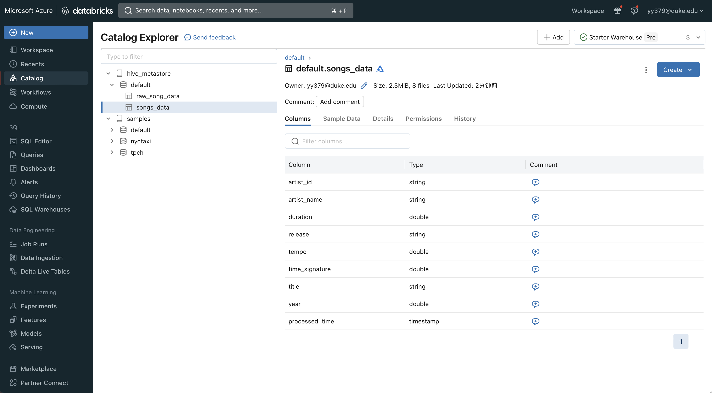
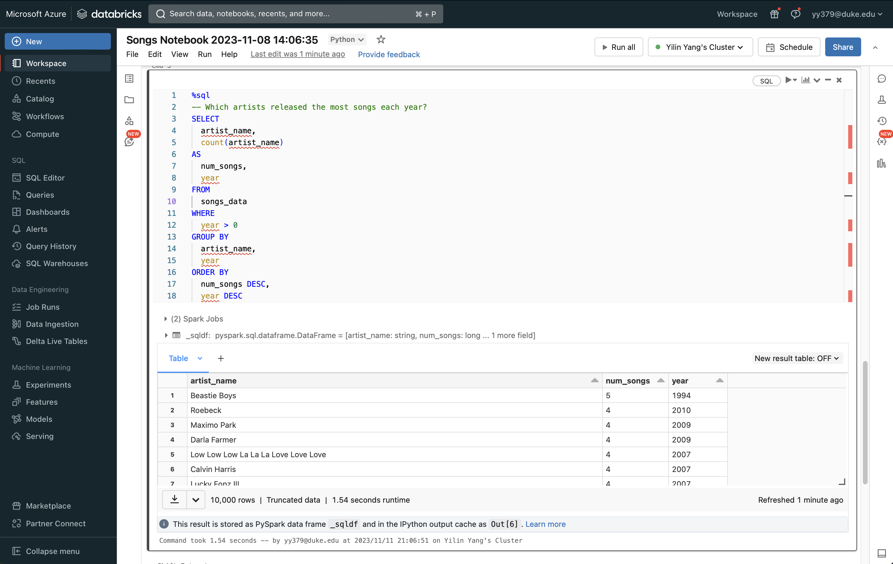
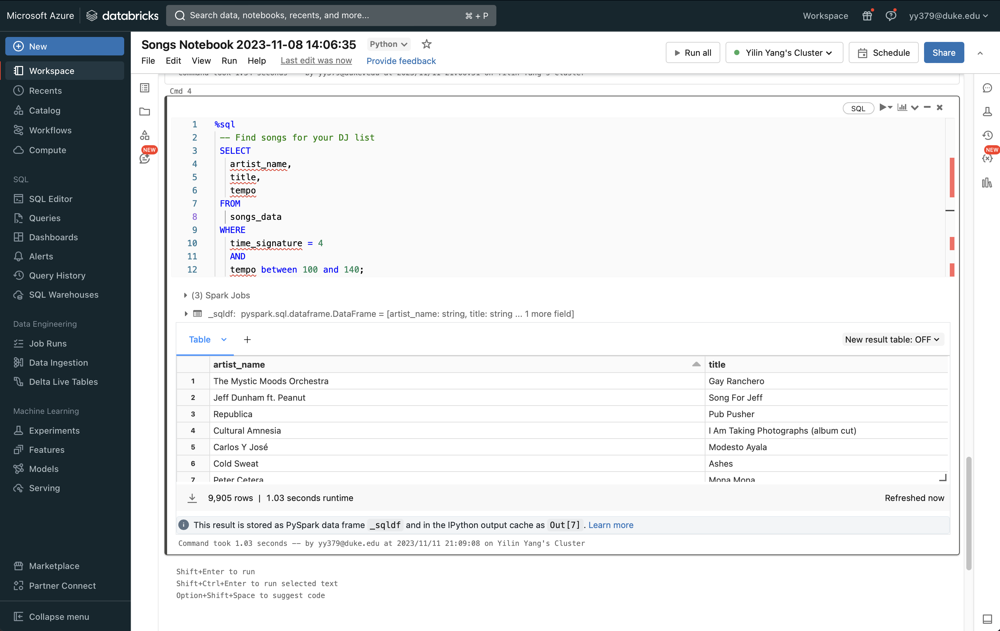

## Individual Project #3: Databricks ETL (Extract Transform Load) Pipeline
- Introduction:
This project is to build a data pipeline using Databricks. The pipeline will extract data from a CSV file, transform the data using Spark, and load the data into a Delta Lake table. The pipeline will be scheduled to run once a day.

## Jupyter Notebook
- [Notebook for Databricks pipeline](https://github.com/nogibjj/Individual-Project3-Yilin/blob/main/Explore%20hive_metastore.default.salaries.ipynb)

## Steps
### Import Data into Delta Lake
> Upload the CSV file from Kaggle to Databricks

> Check the table in warehouse

> Query the raw data

### Prepare the raw data

### Query the transformed data

> Which artists released the most songs each year?

> Find songs for your DJ list

### Create a Databricks job to run the pipeline

### Automated Trigger

### Result

## Reference

1. https://github.com/nogibjj/python-template
2. https://docs.databricks.com/en/getting-started/data-pipeline-get-started.html
3. https://www.kaggle.com/datasets/dparas01/global-ai-ml-data-science-salary/