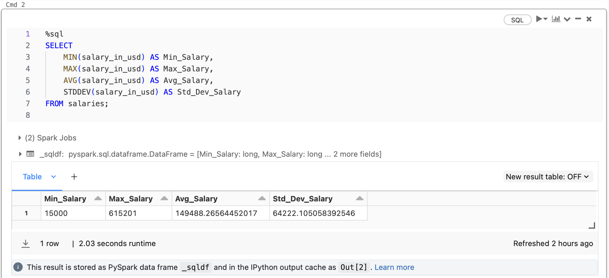

[](https://github.com/nogibjj/python-template/actions/workflows/cicd.yml)
## Individual Project #3: Databricks ETL (Extract Transform Load) Pipeline
- Description:
This project uses the [Global AI, ML, Data Science Salary Dataset](https://www.kaggle.com/datasets/dparas01/global-ai-ml-data-science-salary/) to create an ETL pipeline in Databricks. The pipeline extracts the data from a CSV file, transforms the data, and loads the data into a Delta Lake table. The pipeline is scheduled to run every day at 5:00 AM UTC.

## Jupyter Notebook
- [Notebook for Databricks pipeline](https://github.com/nogibjj/Individual-Project3-Yilin/blob/main/Explore%20hive_metastore.default.salaries.ipynb)

## YouTube Link
- https://www.youtube.com/watch?v=FjU4eGD7Sc8
## Steps
### 1. Import Data into Delta Lake
> Upload the CSV file from Kaggle to Databricks


> Check the table in delta lake


> Query the raw data


### 2. Peforme ETL Pipeline
> Extract the data using Spark
```python
# Read data from Delta Lake into a DataFrame
df = spark.read.format("delta").load("dbfs:/user/hive/warehouse/salaries")
```

> Transform the data for entry-level
```python
# Filter the DataFrame to include only entry-level ('EN') records
df_entry_level = df.filter(col("experience_level") == 'EN')
```

> Load the data into a Delta Lake table
```python
from delta.tables import *
import os

table_path = "dbfs:/user/hive/warehouse/salaries_entry_level"

if DeltaTable.isDeltaTable(spark, table_path):
    # Load the existing Delta table to a DataFrame
    df_entry_level_table = spark.read.format("delta").load(table_path)

    # Merge existing & new data
    df_entry_level_union = df_entry_level_table.union(df_entry_level)

    # Write back to table, ensuring it's registered in the Spark SQL catalog
    df_entry_level_union.write.format("delta").mode("overwrite").option("path", table_path).saveAsTable("salaries_entry_level")

else:
    # Save the DataFrame as a new Delta table
    df_entry_level.write.format("delta").mode("overwrite").option("path", table_path).saveAsTable("salaries_entry_level")
```
### 3. Query the transformed data

> Average entry-level salary by country


### 4. Create a Databricks job to run the pipeline


### 5. Set Automated Trigger


### Result


## Reference

1. https://github.com/nogibjj/python-template
2. https://docs.databricks.com/en/getting-started/data-pipeline-get-started.html
3. https://www.kaggle.com/datasets/dparas01/global-ai-ml-data-science-salary/